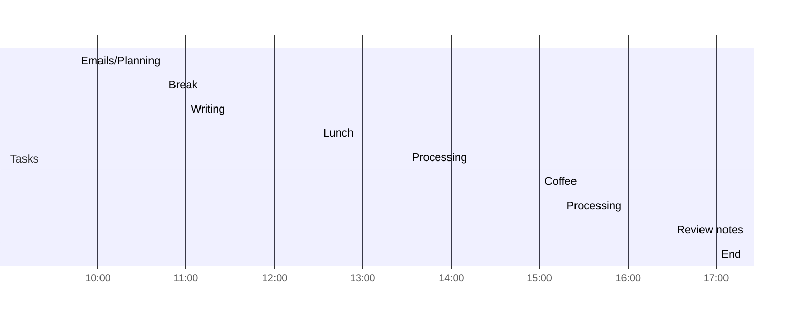

Tags: #daily_note  
# <% tp.file.creation_date("MMMM D") %> Notes 
<< [[<% tp.date.now("YYYY-MM-DD", -1, tp.file.title, "YYYY-MM-DD") %>|<% tp.date.now("YYYY-MM-DD, dddd", -1, tp.file.title, "YYYY-MM-DD") %>]] | [[<% tp.date.now("YYYY-MM-DD", 1, tp.file.title, "YYYY-MM-DD") %>|<% tp.date.now("YYYY-MM-DD, dddd", 1, tp.file.title, "YYYY-MM-DD") %>]]>>

## Objective for today
- <% tp.file.cursor(1) %>

---
Created on <% tp.file.creation_date("MMM DD, YYYY") %> by S. Filhol
Last modified on <% tp.file.last_modified_date("MMM DD, YYYY") %>

 
